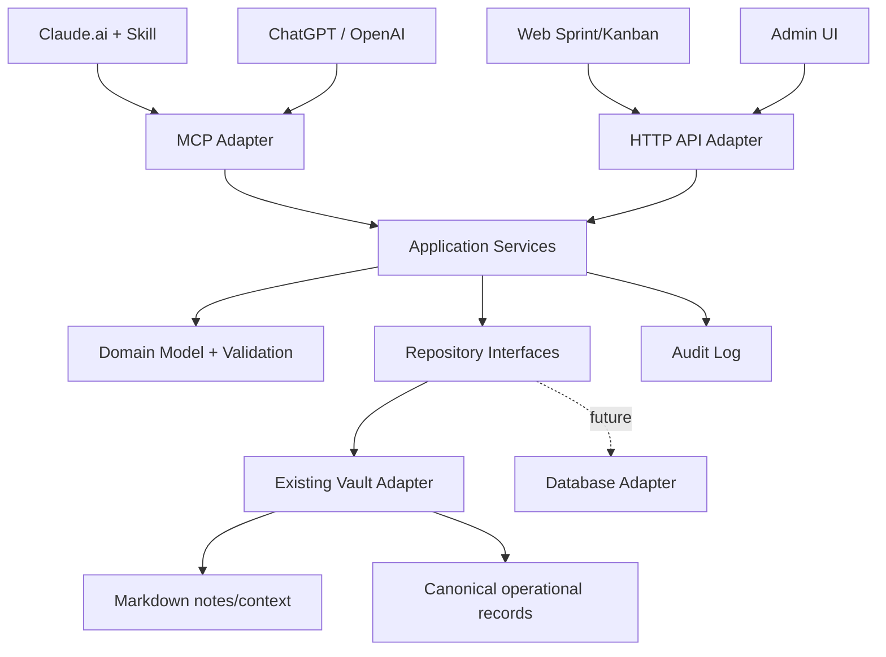

# 04 — Target Architecture

## Binding decision

Build one shared project-management core with separate adapters.



## Layer responsibilities

### Domain

Contains pure business rules:

- entities;
- validation;
- status transitions;
- WIP limits;
- maximum three visible steps;
- capacity calculations;
- approval rules;
- evidence taxonomy;
- definition of done;
- no Netlify, MCP, HTTP or UI imports.

### Application services

Coordinates use cases:

- create/update project;
- plan/activate/close sprint;
- create/update/move task;
- get board;
- get today view;
- search and link vault context;
- prepare/validate/apply decomposition;
- create evidence and decisions;
- audit every write.

### Repository interfaces

Abstract persistence:

- `ProjectRepository`;
- `SprintRepository`;
- `TaskRepository`;
- `ContextRepository`;
- `EvidenceRepository`;
- `ProposalRepository`;
- `AuditRepository`;
- `UnitOfWork` or equivalent transaction boundary.

### Vault adapter — MVP

Preserve and reuse the actual existing persistence mechanism.

Recommended logical separation, subject to source inspection:

```text
vault/
├── notes/                       # human-authored Markdown
├── projects/                    # human-readable project notes/views
└── .desk-os/
    ├── state/
    │   ├── projects/
    │   ├── sprints/
    │   ├── tasks/
    │   ├── evidence/
    │   └── proposals/
    ├── indexes/
    ├── audit/
    └── backups/
```

Operational JSON records should be canonical for the application. Human-readable Markdown may be generated or linked, but must not create two competing editable truths.

If the existing code already has a safer canonical format, preserve it and document the decision.

### MCP adapter

Exposes application services as typed tools.

It must:

- authenticate;
- authorize;
- validate input;
- call application services;
- return structured content;
- annotate read-only/destructive/idempotent behavior;
- never contain duplicated project rules.

### HTTP API adapter

Serves the web frontend and admin surfaces.

It must share the same application services and validation as MCP.

### Web frontend

Use the existing maintainable frontend technology.

Fallback only when no maintainable framework exists:

- Vite;
- React;
- TypeScript;
- existing CSS/design tokens or a minimal token layer;
- Netlify integration;
- PWA-ready, but do not delay MVP for full offline sync.

Do not migrate to Next.js merely for preference. Adopt it only if already present or technically required.

## Workflow intelligence boundary

### MVP

Claude's installed Skill provides adaptive reasoning. MCP tools provide context, validation and persistence.

```text
Claude Skill
→ get context
→ create structured proposal
→ MCP validates proposal
→ human approval
→ MCP applies proposal
```

### Optional later phase

A server-side workflow runner may call an authorized model API so non-Claude clients can execute the same decomposition independently. This requires a separate ADR, cost controls, secrets and model evaluation. It is not MVP.

## Compatibility rule

Current routes remain stable. New UI/API routes may be added, but existing OAuth and vault routes cannot be broken.
