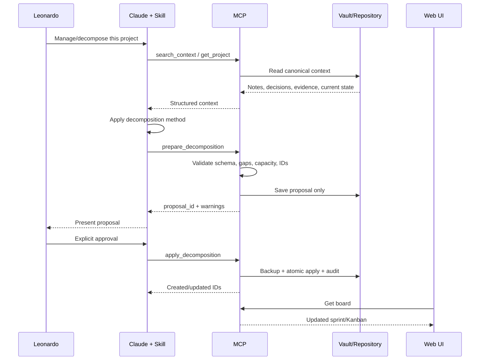

# 07 — Project Decomposition Workflow

## Objective

Transform dispersed project information into an executable, traceable and resumable plan without automatically applying unreviewed AI output.

## MVP execution model

The adaptive reasoning remains in the Claude Skill. The server owns deterministic validation, records, approval and application.

## Workflow



## Required stages

1. **Intake**
   - objective;
   - desired outcome;
   - deadline or horizon;
   - source notes/documents;
   - capacity;
   - constraints.

2. **Context recovery**
   - relevant notes;
   - active projects;
   - prior decisions;
   - evidence;
   - dependencies;
   - conflicts.

3. **Epistemic separation**
   - FACT;
   - EVIDENCE;
   - INFERENCE;
   - HYPOTHESIS;
   - COUNTEREVIDENCE;
   - GAP;
   - DECISION.

4. **Project framing**
   - objective;
   - scope;
   - out of scope;
   - definition of done;
   - deliverables;
   - risks.

5. **Decomposition**
   - deliverables;
   - workflows;
   - tasks;
   - up to three visible steps per task;
   - dependencies;
   - estimates;
   - acceptance criteria.

6. **Capacity and neuroinclusive validation**
   - one dominant daily delivery;
   - one active workflow default;
   - five-day sprint default;
   - WIP check;
   - no overloaded day;
   - clear next action.

7. **Proposal**
   - no direct operational mutation;
   - warnings and gaps visible;
   - proposal ID and version.

8. **Approval**
   - explicit user approval;
   - no approval inferred from silence.

9. **Atomic application**
   - backup;
   - idempotency key;
   - concurrency check;
   - create/update entities;
   - audit event.

10. **Review**
   - board refresh;
   - next action;
   - print summary;
   - rollback path.

## Server validation rules

- task has an observable outcome;
- no more than three steps;
- status is valid;
- project/sprint references exist;
- dependency graph has no cycle;
- dates are coherent;
- IDs are unique;
- proposal version matches;
- approval is explicit;
- apply is idempotent;
- every write creates an audit event.

## Future server-side runner

Only after MVP validation:

```text
raw request
→ server workflow engine
→ model provider adapter
→ schema validation
→ proposal
→ human approval
→ apply
```

This is a separate capability, not a hidden dependency of MVP.
