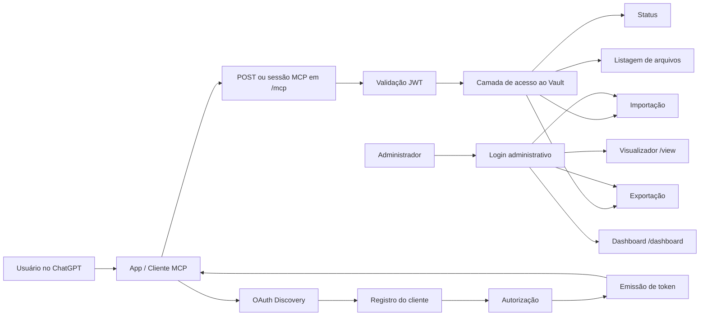

# DESK-OS Vault MCP for OpenAI

> MCP remoto serverless para conectar o ChatGPT/OpenAI a um vault contextual do DESK-OS, com OAuth próprio, autenticação JWT, administração do conteúdo, importação/exportação e superfícies web de consulta.

## 1. Snapshot do ambiente auditado

| Campo | Valor confirmado |
|---|---|
| Projeto Netlify | `desk-os-vault-mcp-openai` |
| URL de produção | `https://desk-os-vault-mcp-openai.netlify.app` |
| Endpoint MCP | `https://desk-os-vault-mcp-openai.netlify.app/mcp` |
| Estado do deploy | `ready` |
| Deploy auditado | `6a5d3bec2c8afd48f16da2bd` |
| Publicação | 19 de julho de 2026 |
| Origem do deploy | API / drop deployment |
| Repositório conectado | Não identificado |
| Framework detectado | `unknown` |
| Runtime das funções | Node.js 20 (`nodejs20.x`) |
| Funções publicadas | 14 |
| Edge Functions | Nenhuma |
| Netlify Forms | Desabilitado |
| Redirects processados | Nenhum |
| Regras de header | 1 |
| Arquivos verificados pelo secret scan | 55 |
| Segredos encontrados no pacote | Nenhum |
| Região observada | `us-east-2` / Functions region `cmh` |

## 2. O que este sistema faz

O projeto funciona como uma camada intermediária entre o ChatGPT/OpenAI e o vault contextual do DESK-OS.

Ele concentra cinco responsabilidades:

1. **Expor um servidor MCP remoto** no endpoint `/mcp`.
2. **Autorizar clientes MCP por OAuth**, incluindo descoberta, registro, autorização e emissão de token.
3. **Proteger chamadas com JWT**, usando segredo exclusivo de produção.
4. **Administrar o vault**, com status, listagem, importação e exportação.
5. **Oferecer superfícies humanas**, incluindo visualizador do vault e dashboard de workflows.

O Apps SDK da OpenAI é baseado em MCP e permite conectar lógica, interface e backend a experiências executadas no ChatGPT. Este projeto implementa a parte remota dessa arquitetura: autenticação, servidor MCP, dados e páginas operacionais.

## 3. Arquitetura confirmada



### Camadas

| Camada | Responsabilidade | Evidência no deploy |
|---|---|---|
| Cliente | ChatGPT, Apps SDK ou outro cliente MCP | Endpoint remoto `/mcp` |
| Protocolo | Transporte e execução MCP | Função `mcp` |
| Identidade | OAuth e tokens | 4 funções OAuth + metadados well-known |
| Segurança | JWT e senha administrativa | `MCP_JWT_SECRET` e `ADMIN_PASSWORD` |
| Aplicação | Operações do vault | Funções `vault-*` |
| Interface | Consulta e operação humana | `/view` e `/dashboard` |
| Infraestrutura | CDN, Functions e configuração | Netlify, Node.js 20 |
| Observabilidade | Instrumentação das funções | Metadados com `netlify-observability-extension` |

## 4. Inventário das funções e rotas

| Função Netlify | Rota pública | Responsabilidade observável |
|---|---|---|
| `health` | `/health` | Health check do serviço |
| `mcp` | `/mcp` | Servidor remoto MCP |
| `oauth-metadata` | `/.well-known/oauth-protected-resource` | Metadados do recurso protegido |
| `oauth-metadata` | `/.well-known/oauth-protected-resource/mcp` | Metadados específicos do recurso MCP |
| `oauth-metadata` | `/.well-known/oauth-authorization-server` | Descoberta do servidor OAuth |
| `oauth-register` | `/oauth/register` | Registro de cliente OAuth |
| `oauth-authorize` | `/oauth/authorize` | Fluxo de autorização |
| `oauth-token` | `/oauth/token` | Emissão ou troca de token |
| `admin-login` | `/api/admin/login` | Autenticação administrativa |
| `admin-logout` | `/api/admin/logout` | Encerramento da sessão administrativa |
| `vault-status` | `/api/vault/status` | Estado operacional do vault |
| `vault-files` | `/api/vault/files` | Listagem ou inventário de arquivos |
| `vault-import` | `/api/vault/import` | Entrada de conteúdo no vault |
| `vault-export` | `/api/vault/export` | Extração do conteúdo do vault |
| `vault-view` | `/view` | Interface de visualização |
| `workflow-dashboard` | `/dashboard` | Interface de workflows |

> Uma função pode responder por mais de uma rota. Por isso, o projeto possui 14 funções, embora a tabela apresente mais rotas.

## 5. Fluxo de autenticação MCP

O desenho publicado indica este fluxo:

1. O cliente consulta os endpoints `/.well-known/*`.
2. O cliente descobre o servidor de autorização e o recurso protegido.
3. O cliente pode realizar registro dinâmico em `/oauth/register`.
4. O usuário é direcionado para `/oauth/authorize`.
5. O cliente troca a autorização por um token em `/oauth/token`.
6. O token é apresentado ao endpoint `/mcp`.
7. O backend valida o token usando `MCP_JWT_SECRET`.
8. As ferramentas MCP autorizadas acessam a camada do vault.

### Separação de autenticação

Existem duas fronteiras de segurança diferentes:

- **MCP/OAuth:** protege o acesso de clientes e agentes ao servidor MCP.
- **Admin:** protege importação, exportação, visualização e dashboard por uma credencial administrativa.

A implementação concreta de cookies, expiração, escopos, PKCE, rotação de tokens e revogação não pôde ser confirmada sem o código-fonte.

## 6. Variáveis de ambiente

| Variável | Tipo | Contexto observado | Finalidade inferida |
|---|---|---|---|
| `PUBLIC_BASE_URL` | Pública | Todos | URL canônica usada por OAuth, callbacks e metadados |
| `MCP_JWT_SECRET` | Secreta | Produção | Assinatura e validação dos tokens JWT |
| `ADMIN_PASSWORD` | Secreta | Produção | Login administrativo |
| `obsidian` | Secreta | Sem valor útil observado | Integração legada ou variável não finalizada |

### Configuração segura

```bash
netlify env:set PUBLIC_BASE_URL "https://SEU-DOMINIO" --context production

netlify env:set MCP_JWT_SECRET "SEGREDO_FORTE" \
  --secret \
  --context production

netlify env:set ADMIN_PASSWORD "SENHA_FORTE" \
  --secret \
  --context production
```

Nunca use prefixos públicos, como `VITE_` ou `PUBLIC_`, para segredos.

## 7. Diferença entre a versão Obsidian e a versão OpenAI

Também foi auditado o projeto relacionado `desk-os-obsidian-vault-mcp`.

### Núcleo compartilhado

As duas versões possuem:

- health check;
- endpoint MCP;
- descoberta OAuth;
- registro OAuth;
- autorização;
- token;
- login e logout administrativos;
- status do vault;
- importação;
- exportação.

### Capacidades adicionadas na versão OpenAI

A versão `desk-os-vault-mcp-openai` acrescenta:

| Capacidade | Função |
|---|---|
| Inventário navegável do vault | `vault-files` |
| Visualização humana do conteúdo | `vault-view` |
| Dashboard operacional | `workflow-dashboard` |

Isso indica uma evolução de um servidor MCP orientado ao vault para um **produto full stack com protocolo, backend, segurança e UI operacional**.

## 8. Estrutura de projeto recomendada

O source ZIP existe no deploy, mas seu conteúdo não foi exposto pelo conector utilizado nesta auditoria. A estrutura abaixo é, portanto, um contrato recomendado para organizar o código — não uma reprodução confirmada do diretório original.

```text
desk-os-vault-mcp-openai/
├── netlify.toml
├── package.json
├── tsconfig.json
├── README.md
├── public/
│   ├── index.html
│   └── assets/
└── netlify/
    └── functions/
        ├── _shared/
        │   ├── auth.ts
        │   ├── jwt.ts
        │   ├── oauth.ts
        │   ├── responses.ts
        │   ├── vault.ts
        │   └── security.ts
        ├── health.ts
        ├── mcp.ts
        ├── oauth-metadata.ts
        ├── oauth-register.ts
        ├── oauth-authorize.ts
        ├── oauth-token.ts
        ├── admin-login.ts
        ├── admin-logout.ts
        ├── vault-status.ts
        ├── vault-files.ts
        ├── vault-import.ts
        ├── vault-export.ts
        ├── vault-view.ts
        └── workflow-dashboard.ts
```

## 9. Desenvolvimento local

### Pré-requisitos

- Node.js compatível com Node 20;
- Netlify CLI;
- variáveis de ambiente locais;
- código-fonte original ou source ZIP do deploy.

### Comandos esperados

```bash
npm install
netlify link
netlify env:list
netlify dev
```

Para testar o build no mesmo modelo da plataforma:

```bash
netlify build
```

Para criar um deploy de pré-visualização:

```bash
netlify deploy
```

Para publicar em produção:

```bash
netlify deploy --prod
```

> O projeto auditado foi publicado por API/drop deployment e não possui commit, branch ou repositório associados no Netlify. Antes de evoluir o código, recomenda-se vinculá-lo a um repositório Git e tornar o deploy reproduzível.

## 10. Integração com OpenAI/ChatGPT

### Endpoint principal

```text
https://desk-os-vault-mcp-openai.netlify.app/mcp
```

### Descoberta OAuth

```text
https://desk-os-vault-mcp-openai.netlify.app/.well-known/oauth-protected-resource
https://desk-os-vault-mcp-openai.netlify.app/.well-known/oauth-protected-resource/mcp
https://desk-os-vault-mcp-openai.netlify.app/.well-known/oauth-authorization-server
```

### Fluxo esperado no ChatGPT

1. Criar ou configurar um app MCP personalizado no ambiente compatível.
2. Informar a URL do servidor MCP.
3. Permitir que o cliente descubra a configuração OAuth.
4. Realizar a autorização.
5. Testar descoberta e execução das ferramentas.
6. Validar separadamente ferramentas somente leitura e ferramentas de escrita.
7. Exigir confirmação explícita para importação, sobrescrita ou outras mutações.

A disponibilidade do modo de desenvolvedor e de apps MCP completos depende do plano e das configurações do workspace.

## 11. Segurança e governança

### Controles confirmados

- segredo JWT separado;
- senha administrativa separada;
- variáveis sensíveis marcadas como secret;
- secret scan sem ocorrências no pacote auditado;
- endpoints OAuth de descoberta;
- ausência de credenciais públicas no metadata do deploy;
- funções executadas no backend, não no navegador.

### Riscos identificados

| Prioridade | Risco | Evidência | Ação recomendada |
|---|---|---|---|
| Alta | Deploy não reproduzível | Sem Git, commit ou branch | Vincular a repositório e CI/CD |
| Alta | Código-fonte não auditado | Source ZIP não acessível pelo conector | Recuperar e revisar o pacote |
| Alta | Persistência desconhecida | Nenhum datastore identificado no metadata | Documentar storage, backup e recuperação |
| Alta | Escopos e tools MCP desconhecidos | Schema da função `mcp` não exposto | Inventariar tools, inputs, outputs e permissões |
| Alta | Sem proteção Netlify de visitante | Password/SSO do site desativados | Confirmar que todas as rotas sensíveis exigem auth no app |
| Média | Segredos apenas em produção | Contextos dev/preview vazios | Criar segredos separados por ambiente |
| Média | Variável `obsidian` vazia | Variável secreta sem valor | Remover ou documentar |
| Média | Headers não auditados | Só foi confirmado que existe 1 regra | Validar CSP, HSTS, CORS e anti-clickjacking |
| Média | Sem redirects | Nenhuma regra processada | Confirmar que todas as rotas dependem apenas de path config |
| Média | Ausência de rate limiting confirmado | Não visível no deploy | Adicionar proteção a OAuth, login e MCP |
| Média | Rotação/revogação desconhecidas | Código não disponível | Definir TTL, refresh, revoke e rotação de chaves |
| Baixa | Framework não detectado | Netlify retorna `unknown` | Declarar stack e scripts no README/package |

## 12. Observabilidade mínima recomendada

Registrar, sem persistir dados sensíveis:

- `requestId`;
- nome da função;
- status HTTP;
- duração;
- cliente OAuth;
- tool MCP chamada;
- resultado `success/error`;
- tipo de erro;
- quantidade de arquivos processados;
- tamanho de importação/exportação;
- versão do deploy;
- timestamp UTC.

Não registrar:

- JWT completo;
- senha administrativa;
- conteúdo integral do vault;
- authorization code;
- refresh token;
- dados pessoais não necessários.

## 13. Contrato operacional do vault

O vault deve ser tratado como fonte contextual governada, não como pasta sem schema.

Cada operação deveria produzir:

```yaml
operation_id: string
operation: status | list | import | export | read | search
actor_type: user | admin | mcp_client
actor_id: string
timestamp: ISO-8601
deploy_id: string
input_summary: string
files_affected: integer
result: success | partial | error
evidence:
  - path: string
    hash: string
warnings: []
```

Para mutações:

```yaml
approval:
  required: true
  approved_by: string
  approved_at: ISO-8601
backup:
  created: true
  artifact_id: string
rollback:
  available: true
```

## 14. Critérios de aceite técnico

O serviço está pronto para uso controlado quando:

- [ ] `/health` responde de forma consistente;
- [ ] descoberta OAuth retorna URLs canônicas HTTPS;
- [ ] registro de cliente rejeita redirect URIs inválidas;
- [ ] autorização suporta estado e proteção contra CSRF;
- [ ] token possui expiração e audiência corretas;
- [ ] `/mcp` rejeita token ausente, expirado ou inválido;
- [ ] cada tool possui schema validado;
- [ ] tools de escrita são claramente marcadas;
- [ ] operações destrutivas exigem aprovação;
- [ ] importação valida tipo, tamanho e path;
- [ ] exportação impede vazamento entre usuários;
- [ ] login administrativo possui rate limiting;
- [ ] cookies administrativos são `HttpOnly`, `Secure` e `SameSite`;
- [ ] logs não contêm segredos ou conteúdo do vault;
- [ ] deploy pode ser reproduzido a partir de Git;
- [ ] backup e rollback foram testados.

## 15. Lacunas desta auditoria

O conector Netlify permitiu confirmar projeto, deploy, funções, rotas, runtime, variáveis e configuração operacional. Ele não expôs:

- conteúdo do source ZIP;
- arquivos TypeScript/JavaScript;
- `package.json`;
- `netlify.toml`;
- schemas das tools MCP;
- métodos HTTP aceitos por cada rota;
- formato das respostas;
- implementação do OAuth;
- mecanismo de persistência;
- políticas CORS e headers detalhadas;
- testes automatizados;
- logs de execução;
- conteúdo das interfaces `/view` e `/dashboard`.

Consequentemente, este README descreve com alta confiança a **arquitetura implantada**, mas ainda não substitui uma auditoria linha a linha do código.

## 16. Próxima ação recomendada

**Recuperar o source ZIP do deploy `6a5d3bec2c8afd48f16da2bd`, versioná-lo em Git e executar uma auditoria de código focada em OAuth, schemas MCP, persistência, isolamento de dados e operações de escrita.**

## Referências

- OpenAI — Build with the Apps SDK: https://help.openai.com/en/articles/12515353-build-with-the-apps-sdk
- OpenAI — Developer mode and MCP apps in ChatGPT: https://help.openai.com/en/articles/12584461
- Netlify — Functions documentation: https://docs.netlify.com/build/functions/overview/
- Netlify — Environment variables: https://docs.netlify.com/build/configure-builds/environment-variables/
- Model Context Protocol: https://modelcontextprotocol.io/
